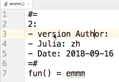

# Exchange Code blocks

# Usage

- select first block then <kbd>ctrl or ⌘ (for Mac) </kbd> + <kbd>alt</kbd> + <kbd>C</kbd>
- select second block then <kbd>ctrl or ⌘ (for Mac) </kbd> + <kbd>alt</kbd> + <kbd>V</kbd>